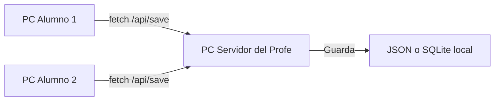

# Guía de Persistencia en la Nube y Red Local para PrompterQuest 🚀
*Diseñada especialmente para Docentes de Tecnología y Educadores*

¡Hola, colega! Esta guía didáctica tiene como objetivo explicarte de forma sencilla cómo funciona el sistema de almacenamiento de datos actual en **PrompterQuest** y cómo dar el gran salto para transformarlo en una plataforma multiusuario. Esto permitirá que tus estudiantes inicien sesión desde cualquier computador en la sala de informática del colegio sin perder sus valiosos puntos de experiencia (XP), rachas de días activos ni lecciones completadas.

---

## Parte 1: ¿Cómo funciona el sistema actual en la Web? (Persistencia Local)

Actualmente, **PrompterQuest** utiliza una tecnología nativa del navegador web llamada **`localStorage`**. 

Piensa en `localStorage` como una pequeña libreta de notas privada que cada navegador de internet (Chrome, Edge, Firefox, etc.) guarda de forma exclusiva para un sitio web específico en el disco duro de esa computadora.

### El Estado del Juego en [app.js](file:///c:/Users/ANDRES%20MARIN/Desktop/PROYECTOS%20WEB/IAGAME/app.js)

En el archivo [app.js](file:///c:/Users/ANDRES%20MARIN/Desktop/PROYECTOS%20WEB/IAGAME/app.js) definimos la estructura de datos que representa todo el progreso del alumno, llamada [DEFAULT_GAME_STATE](file:///c:/Users/ANDRES%20MARIN/Desktop/PROYECTOS%20WEB/IAGAME/app.js#L8-L18):

```javascript
const DEFAULT_GAME_STATE = {
    username: "Estudiante Prompter",
    avatarEmoji: "🚀",
    xp: 0,
    level: 1,
    streak: 1,
    hearts: 5,
    lessonsCompleted: [], // Guarda los IDs de las lecciones pasadas (ej: "1_1", "1_2")
    activeView: "dashboard",
    theme: "dark"
};
```

Para gestionar este estado localmente, implementamos tres funciones principales:

#### A. Guardar Progreso: [saveGameState](file:///c:/Users/ANDRES%20MARIN/Desktop/PROYECTOS%20WEB/IAGAME/app.js#L40-L43)
Cada vez que el estudiante responde una pregunta correctamente, gana XP, cambia de menú o cambia de tema visual, se ejecuta esta función:

```javascript
function saveGameState() {
    // 1. Convertimos el objeto javascript a una cadena de texto (JSON string)
    // 2. Lo guardamos en localStorage bajo la clave "prompterquest_state"
    localStorage.setItem("prompterquest_state", JSON.stringify(gameState));
    
    // 3. Actualizamos las estadísticas en pantalla inmediatamente
    updateGlobalUIStats();
}
```

#### B. Cargar Progreso: [loadGameState](file:///c:/Users/ANDRES%20MARIN/Desktop/PROYECTOS%20WEB/IAGAME/app.js#L23-L37)
Al momento en que la página web se carga en el navegador, necesitamos recuperar el avance anterior:

```javascript
function loadGameState() {
    // 1. Buscamos si existe información previa bajo nuestra clave
    const savedState = localStorage.getItem("prompterquest_state");
    if (savedState) {
        try {
            // 2. Si existe, traducimos el texto de vuelta a un objeto y lo combinamos
            // con el estado por defecto para evitar incompatibilidades si agregamos campos nuevos.
            gameState = { ...DEFAULT_GAME_STATE, ...JSON.parse(savedState) };
        } catch (e) {
            console.error("Error al cargar el estado, restableciendo...", e);
            gameState = { ...DEFAULT_GAME_STATE };
        }
    }
    // 3. Actualizamos todos los elementos visuales de la aplicación con los datos cargados
    applyTheme(gameState.theme);
    updateGlobalUIStats();
    renderLeaderboard();
    renderAchievements();
}
```

#### C. Reiniciar Progreso: [resetGameState](file:///c:/Users/ANDRES%20MARIN/Desktop/PROYECTOS%20WEB/IAGAME/app.js#L46-L57)
Si un alumno comete muchos errores y quiere comenzar su aventura desde cero, esta función borra su estado, restablece los valores predeterminados y actualiza la pantalla:

```javascript
function resetGameState() {
    if (confirm("¿Estás seguro de que quieres borrar todo tu progreso...?")) {
        gameState = { ...DEFAULT_GAME_STATE };
        gameState.lessonsCompleted = [];
        saveGameState(); // Guarda el estado vacío
        loadGameState();  // Recarga los contadores
        updateDashboardNodes();
        initSandbox();
        showView("dashboard");
    }
}
```

### ⚠️ El Gran Problema de la Persistencia Local en Colegios
Aunque `localStorage` es rápido, sencillo y no requiere servidores externos ni internet, tiene **tres grandes limitaciones** en un contexto educativo:
1. **Es local al computador y al navegador:** Si el alumno Juanito realiza 5 lecciones en el *Computador 4*, y a la siguiente clase se sienta en el *Computador 12*, su progreso estará en **cero** porque los datos están físicamente atrapados en el disco duro del *Computador 4*.
2. **Deep Freeze o Software de Congelamiento:** Muchos laboratorios escolares utilizan herramientas que restauran la computadora a su estado original cada vez que se reinicia. Esto borraría automáticamente el `localStorage` de los navegadores.
3. **Múltiples alumnos en un PC:** Si dos alumnos de cursos distintos usan el mismo PC en distintos bloques horariios, su progreso se mezclará en el navegador.

---

## Parte 2: El Siguiente Paso: Centralización en la Nube (Opción Gratuita con Firebase)

Para resolver este desafío, la mejor opción moderna es migrar a **Firebase**, una plataforma de Google que ofrece autenticación de usuarios e base de datos en la nube de forma **100% gratuita** para proyectos medianos o educativos.

### ¿Cómo funcionará el nuevo sistema?
Cuando un alumno abra la página web, verá una pantalla de **"Inicio de Sesión"**. Escribirá su nombre de usuario o correo escolar y una contraseña. El sistema se comunicará con internet para descargar su perfil de juego único y guardará su avance automáticamente en la base de datos de la nube en tiempo real.

```mermaid
graph TD
    subgraph Cliente (Computador de la Sala)
        A[Navegador del Alumno] -->|1. Inicia sesión| B(SDK de Firebase)
        B -->|2. Pide datos de progreso| C{¿Tiene progreso guardado?}
        C -->|Sí| D[Cargar en Pantalla]
        C -->|No| E[Inicializar Nuevo Progreso]
    end
    subgraph Servidor (En la Nube de Google)
        B <-->|Autenticar| F[Firebase Auth]
        C <-->|Leer/Escribir Datos| G[(Cloud Firestore)]
    end
```

---

### Guía de Implementación Paso a Paso

#### Paso 1: Crear el Proyecto en Firebase
1. Ve a [Firebase Console](https://console.firebase.google.com/) con tu cuenta de Google.
2. Haz clic en **Crear un Proyecto** y llámalo `PrompterQuest`.
3. Ve a la pestaña **Authentication** en el menú izquierdo, haz clic en **Comenzar** y activa el proveedor de **Correo electrónico/contraseña** (o "Anónimo" si prefieres que no ingresen contraseñas reales).
4. Ve a la pestaña **Firestore Database**, haz clic en **Crear Base de Datos**, elige una ubicación cercana (ej. `us-central`) y selecciona **Modo de Prueba** (para comenzar a trabajar rápidamente sin restricciones iniciales de seguridad).

#### Paso 2: Vincular Firebase a tu aplicación HTML
En tu archivo [index.html](file:///c:/Users/ANDRES%20MARIN/Desktop/PROYECTOS%20WEB/IAGAME/index.html), justo antes de cerrar la etiqueta `</body>` y ANTES de importar tu `app.js`, añade las librerías del SDK de Firebase (usaremos la versión modular simplificada):

```html
<!-- Importar Firebase SDK (Core y Servicios necesarios) -->
<script src="https://www.gstatic.com/firebasejs/10.8.0/firebase-app-compat.js"></script>
<script src="https://www.gstatic.com/firebasejs/10.8.0/firebase-auth-compat.js"></script>
<script src="https://www.gstatic.com/firebasejs/10.8.0/firebase-firestore-compat.js"></script>

<script>
  // Las credenciales provistas por Firebase al registrar tu App Web
  const firebaseConfig = {
    apiKey: "TU_API_KEY_AQUÍ",
    authDomain: "tu-proyecto.firebaseapp.com",
    projectId: "tu-proyecto",
    storageBucket: "tu-proyecto.appspot.com",
    messagingSenderId: "tu_sender_id",
    appId: "tu_app_id"
  };
  
  // Inicializamos Firebase
  firebase.initializeApp(firebaseConfig);
  
  // Guardamos las referencias globales para usarlas en app.js
  const auth = firebase.auth();
  const db = firebase.firestore();
</script>

<!-- Tu script del juego principal -->
<script src="app.js"></script>
```

#### Paso 3: Adaptar [app.js](file:///c:/Users/ANDRES%20MARIN/Desktop/PROYECTOS%20WEB/IAGAME/app.js) para usar la Nube
En tu código Javascript, reemplazaremos la lógica de persistencia local por funciones asíncronas conectadas con Firebase.

Reemplaza tus antiguas funciones por el siguiente código de ejemplo didáctico:

```javascript
// Variable para identificar al alumno actual en la sesión
let currentUser = null;

// ==========================================================================
// NUEVO SISTEMA DE PERSISTENCIA (FIREBASE EN LA NUBE)
// ==========================================================================

// 1. Guardar Estado en la Nube
async function saveGameState() {
    // Si no hay ningún usuario con sesión iniciada, guardamos temporalmente en localStorage
    if (!currentUser) {
        localStorage.setItem("prompterquest_state", JSON.stringify(gameState));
        updateGlobalUIStats();
        return;
    }

    try {
        // Guardamos todo el estado directamente en la colección 'estudiantes'
        // bajo un documento identificado por el ID único del alumno (UID)
        await db.collection("estudiantes").doc(currentUser.uid).set(gameState);
        console.log("¡Progreso sincronizado en la nube con éxito!");
    } catch (error) {
        console.error("Error al guardar en la nube: ", error);
    }
    
    updateGlobalUIStats();
}

// 2. Cargar Estado de la Nube
async function loadGameState() {
    if (!currentUser) {
        // Si no ha iniciado sesión, intentar cargar del localStorage (modo invitado)
        const savedState = localStorage.getItem("prompterquest_state");
        if (savedState) {
            gameState = { ...DEFAULT_GAME_STATE, ...JSON.parse(savedState) };
        } else {
            gameState = { ...DEFAULT_GAME_STATE };
        }
        applyTheme(gameState.theme);
        updateGlobalUIStats();
        return;
    }

    try {
        // Solicitamos el documento del alumno a Firestore
        const docRef = db.collection("estudiantes").doc(currentUser.uid);
        const docSnap = await docRef.get();

        if (docSnap.exists) {
            // El alumno ya tiene datos guardados en la nube: los cargamos
            gameState = { ...DEFAULT_GAME_STATE, ...docSnap.data() };
            console.log("¡Progreso del alumno descargado de la nube!");
        } else {
            // Es su primer ingreso: creamos un registro inicial
            gameState = { ...DEFAULT_GAME_STATE, username: currentUser.displayName || "Estudiante IA" };
            await docRef.set(gameState);
            console.log("¡Perfil inicial creado en la nube!");
        }
    } catch (error) {
        console.error("Error al cargar de la nube: ", error);
    }

    // Refrescar UI del juego
    applyTheme(gameState.theme);
    updateGlobalUIStats();
    renderLeaderboard();
    renderAchievements();
}
```

#### Paso 4: Monitorear el inicio y cierre de sesión
Para que la aplicación sepa cuándo el alumno entra o sale del sistema, Firebase nos ofrece un "escucha" automático. Agrégalo al final de tu archivo [app.js](file:///c:/Users/ANDRES%20MARIN/Desktop/PROYECTOS%20WEB/IAGAME/app.js):

```javascript
// Escuchador de estado de autenticación
auth.onAuthStateChanged(async (user) => {
    if (user) {
        // El alumno ha iniciado sesión con éxito
        currentUser = user;
        console.log("Sesión activa de:", user.email);
        await loadGameState(); // Carga sus datos desde la nube
        updateDashboardNodes(); // Dibuja su mapa de lecciones
    } else {
        // No hay sesión
        currentUser = null;
        console.log("Sin sesión de usuario activa.");
        loadGameState(); // Carga el estado local/vacío
    }
});
```

---

## Parte 3: Alternativa 100% Offline (Servidor de Red Local en el Aula)

**¿Qué pasa si el internet de tu colegio es inestable o no tiene salida a la red exterior?** 

¡No te preocupes! Puedes crear un **Servidor Escolar de Red Local**. Solo requieres que la computadora del docente corra un pequeño servicio que centralice los datos, y todos los computadores de los alumnos se conectarán a ella a través del router de la sala.

### ¿Cómo funciona la Red Local?
El profesor ejecuta una mini aplicación en Node.js que guarda el progreso de los alumnos en un simple archivo JSON en su disco duro. La dirección web del juego para los alumnos será algo como `http://192.168.1.50:3000` (reemplazando por la IP interna del computador del profesor).



### Código simplificado del Servidor local (Node.js + Express)
El docente crea una carpeta llamada `prompter-server` en su PC, instala Express con `npm install express cors` y escribe este archivo `server.js`:

```javascript
const express = require('express');
const cors = require('cors');
const fs = require('fs');
const app = express();

app.use(cors()); // Permite conexiones de otros PCs de la sala
app.use(express.json());

const ARCHIVO_BD = './progreso_estudiantes.json';

// Cargar datos del archivo
function leerDatos() {
    if (!fs.existsSync(ARCHIVO_BD)) return {};
    return JSON.parse(fs.readFileSync(ARCHIVO_BD, 'utf-8'));
}

// Guardar datos en el archivo
function guardarDatos(data) {
    fs.writeFileSync(ARCHIVO_BD, JSON.stringify(data, null, 2));
}

// Endpoint para obtener el progreso de un alumno
app.post('/api/obtener-progreso', (req, res) => {
    const { username } = req.body;
    const db = leerDatos();
    
    if (db[username]) {
        res.json({ success: true, state: db[username] });
    } else {
        res.json({ success: false, msg: "Usuario nuevo creado" });
    }
});

// Endpoint para guardar progreso
app.post('/api/guardar-progreso', (req, res) => {
    const { username, state } = req.body;
    const db = leerDatos();
    
    db[username] = state; // Guardamos el estado del juego bajo el nombre del estudiante
    guardarDatos(db);
    res.json({ success: true });
});

app.listen(3000, () => console.log('¡Servidor de la Sala corriendo en el puerto 3000!'));
```

### Cómo modificar tu cliente web [app.js](file:///c:/Users/ANDRES%20MARIN/Desktop/PROYECTOS%20WEB/IAGAME/app.js) para la Red Local
En vez de `localStorage`, el cliente usará comandos estándar `fetch` apuntando al PC del profesor:

```javascript
const IP_SERVIDOR = "192.168.1.50"; // La IP del PC del Profesor en la sala de computación

// Guardar estado en el Servidor local del aula
async function saveGameState() {
    updateGlobalUIStats();
    
    try {
        await fetch(`http://${IP_SERVIDOR}:3000/api/guardar-progreso`, {
            method: 'POST',
            headers: { 'Content-Type': 'application/json' },
            body: JSON.stringify({
                username: gameState.username, // Usamos el nombre del alumno como ID
                state: gameState
            })
        });
        console.log("Progreso guardado en el servidor del profesor.");
    } catch (e) {
        console.warn("No se pudo conectar al servidor local, guardando en el navegador...", e);
        localStorage.setItem("prompterquest_state", JSON.stringify(gameState));
    }
}

// Cargar estado desde el Servidor local
async function loadGameState() {
    try {
        const respuesta = await fetch(`http://${IP_SERVIDOR}:3000/api/obtener-progreso`, {
            method: 'POST',
            headers: { 'Content-Type': 'application/json' },
            body: JSON.stringify({ username: gameState.username })
        });
        const datos = await respuesta.json();
        
        if (datos.success) {
            gameState = { ...DEFAULT_GAME_STATE, ...datos.state };
            console.log("Progreso cargado desde el servidor de la sala.");
        }
    } catch (e) {
        console.warn("Servidor desconectado. Usando almacenamiento local.");
        const savedState = localStorage.getItem("prompterquest_state");
        if (savedState) {
            gameState = { ...DEFAULT_GAME_STATE, ...JSON.parse(savedState) };
        }
    }
    
    applyTheme(gameState.theme);
    updateGlobalUIStats();
    renderLeaderboard();
    renderAchievements();
}
```

---

## 🎯 Resumen de Decisiones y Pasos Sugeridos para tu Clase

¿Cuál opción te conviene más elegir para tus alumnos de Primero Medio?

| Característica | Opción A: Firebase (Nube) ☁️ | Opción B: Servidor Escolar (Local) 🖥️ |
| :--- | :--- | :--- |
| **Requisito de Internet** | Sí, continuo y estable. | No, funciona 100% sin internet. |
| **Configuración inicial** | Media (Crear proyecto en consola web). | Alta (Instalar Node.js en tu PC). |
| **Facilidad para el alumno** | Excelente (Crean su cuenta con email y listo). | Excelente (Solo escriben su nombre). |
| **Costo** | Gratuito (en capa gratuita). | Gratuito para siempre. |
| **Seguridad de datos** | Alta (Respaldos en servidores de Google). | Media (Depende de que no borres el archivo del PC). |

### Sugerencia Didáctica para una actividad de aula:
Puedes utilizar esta misma migración de persistencia como una **clase práctica de Redes y Bases de Datos** para tus alumnos. 
1. Explícales el principio del almacenamiento de datos.
2. Compárales el almacenamiento "local" (como guardar una partida de consola en una memory card vieja) frente al almacenamiento "en la nube" (como las partidas guardadas en Steam o iCloud).
3. ¡Motívalos a probar los límites de la red local enviando peticiones HTTP simuladas!

---
*¡Mucho éxito en tus clases de tecnología e Inteligencia Artificial! Si necesitas más ayuda adaptando el diseño o configurando los endpoints, no dudes en preguntar.*
